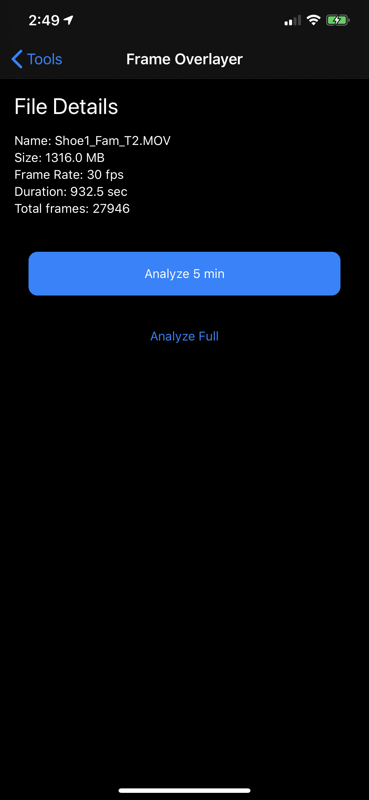
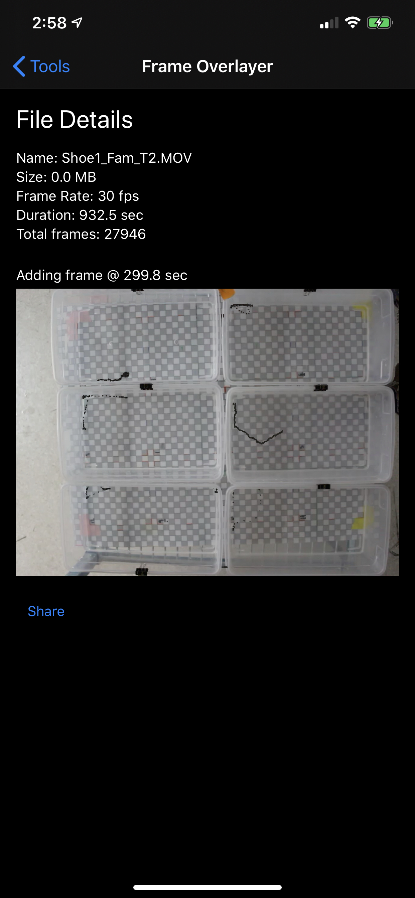

# Video Frames Overlay

## Overview

Stack frames of a video on top of one another to produce an image that shows the "path" an object took throughout the video.

The current implementation assumes that the background of the video will be light/white and the subject that is being tracked will be dark/black. It also assumes that the video camera is stationary.

As each frame is processed, any pixel of the frame that does not meet a certain darkness threshold is discarded (made transparant). This produces the effect of the combined image showing the "path" of the object over time.

## App Features

- [x] Select a video file and show metadata about the file
- [x] Choose between analyzing the entire video or just the first 5 minues (note: if the file is shorter than 5 min, the entire video will be analyzed regardless)
- [x] Update the combined/stacked image in real-time as the video is being processed
- [x] Report back progress in real-time about which frame is being added to the combined/stacked image
- [x] Ability to export final combined/stacked image

## Screenshots

|                          Setup                           |                           Complete                           |
| :------------------------------------------------------: | :----------------------------------------------------------: |
|  |  |

