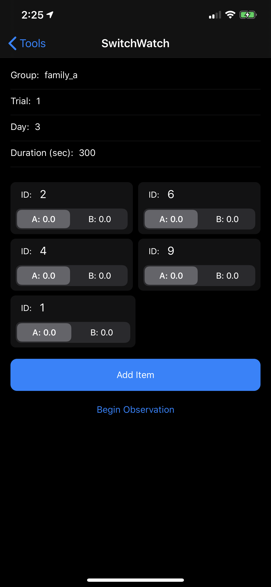
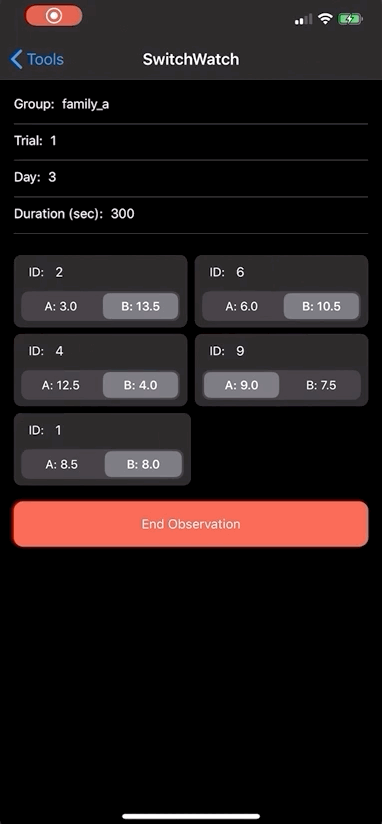
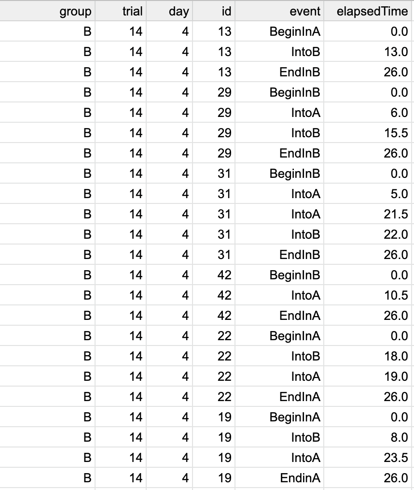
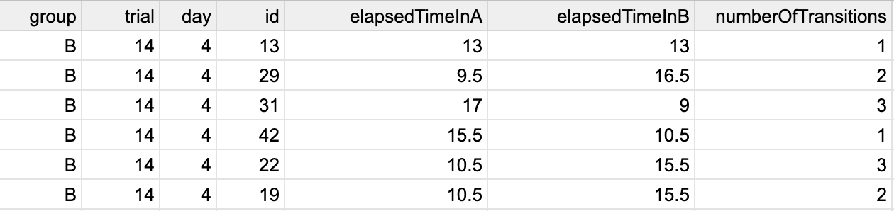

# SwitchWatch

## Overview

SwitchWatch provides a mechanism to observe multiple subjects over time as they move between two states. 

For example:

- Recording test subjects moving between light/dark areas
- Recording test subjects moving between middle/edge of test area
- etc...

## App Features

- [x] Input Group Name, Trial Number, and Trial Day for an observation session
- [x] Configure multiple items to observe simultaneously
- [x] After beginning an observation, toggle an item to record a transition and swap that item's active timer
- [x] Export data
- [x] Automatically end a observation session after a pre-set amount of time

## Potential Future Features
- [ ] Ability to save/edit previous observation sessions

## Screenshots

|                            Setup                             |                           Complete                           |
| :----------------------------------------------------------: | :----------------------------------------------------------: |
|  |  |

## Example Data Export

After completing an observation session, tap "share" to export two files.

### <groupName\>_raw_transition_times.csv

As the name suggests, this file contains all the raw data recorded from every tap of every toggle throughout the session. Importing into excel/sheets/numbers looks something like:

 

### <groupName\>_stats.csv

This file provides the rolled-up stats for each item during the observation session:

